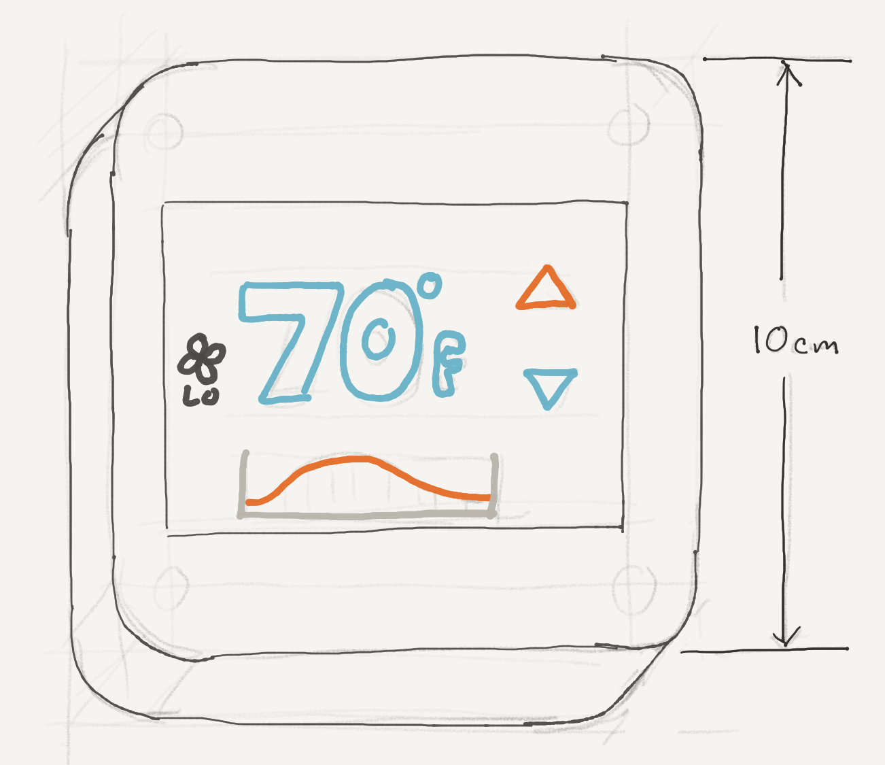

# Therm

Therm is a Meadow-powered, open-source, smart thermostat that you can build at home.

## Design Requirements

* 24V AC power input 
* PID temp control
* Full system control; heating, cooling, fan, etc.
* Mobile Application Interface
* Standard 1-gang mount

## Notes

### Wiring

[Thermostat C-Wiring](https://smartthermostatguide.com/thermostat-c-wire-explained/)

Common:

* **Blue or Black** – C – Common wire, may be unused by your existing thermostat. Enables continuous power flow from the Red wire.
* **Red** – R – 24VAC power from the furnace’s transformer
* **Red** – Rc – 24VAC (dedicated to heat call)
* **Red** – Rc – 24VAC (dedicated to cooling call)
* **Green** – G – Fan
* **White** – W – Heat
* **Yellow** – Y – Air conditioner

### Power

Long term, churn a circuit like [this](https://rayshobby.net/wordpress/24vac-to-5vdc-conversion/). 

Near-term, use [this](https://www.amazon.com/SMAKN%C2%AE-Converter-Voltage-Supply-Waterproof/dp/B00RE6QN4U).